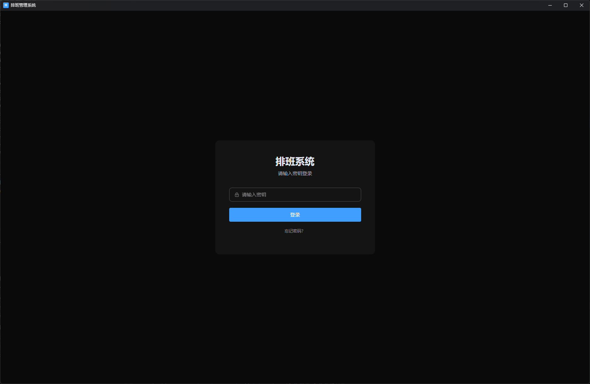
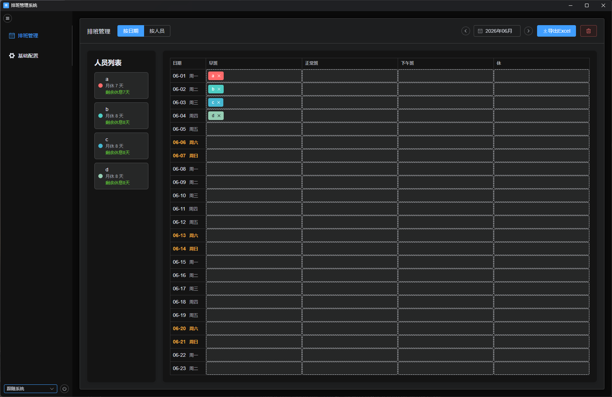
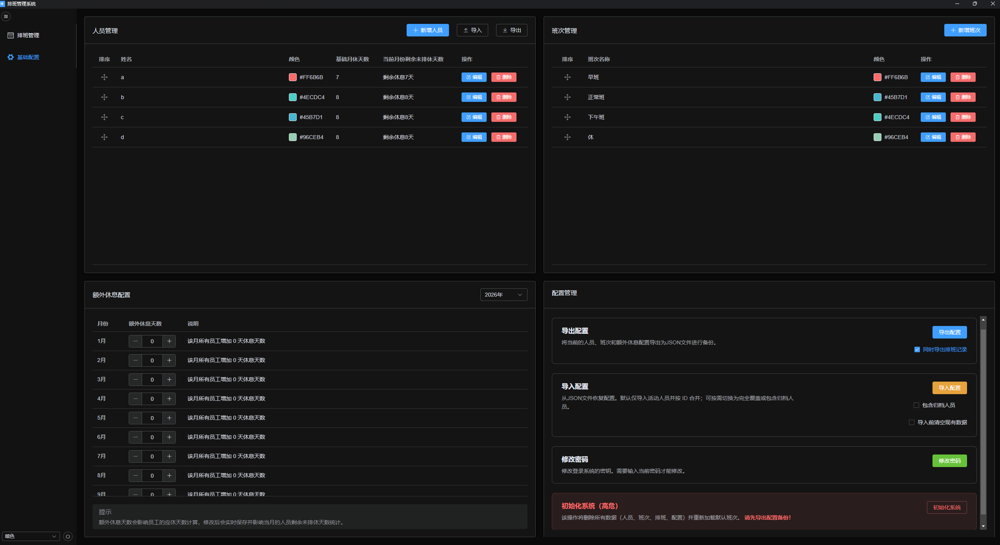

# 排班管理系统

基于 `Vue 3 + TypeScript + Element Plus + IndexedDB + Electron` 的单仓库排班系统。

当前仓库同时承载：

- Web 开发与构建
- Electron 桌面开发运行
- Windows 桌面程序打包
- 本地配置导入导出与离线数据持久化

## 项目定位

这是一个本地优先的排班工具，核心数据保存在浏览器或 Electron 容器内的 IndexedDB 中，不依赖后端服务即可完成日常排班、人员维护、班次维护、配置备份和桌面打包发布。

当前仓库是唯一主仓库，不再依赖外部 `electron-shell` 壳项目。

## 界面截图

截图资源已整理到 `docs/images/`，避免与运行时代码和打包资源混放。

### 登录页



### 排班主页



### 基础配置页



## 主要功能

### 业务功能

- 人员管理：新增、编辑、导入、导出、归档人员
- 班次管理：新增、编辑、归档班次
- 排班管理：按月份进行拖拽排班、查看、修改、删除
- 人员视图：按人员维度查看月度排班和休息统计
- 额外休息配置：按月份配置补休/额外休息天数
- 配置管理：导出配置、导入配置、修改登录密码、系统初始化
- Excel 导出：导出月度排班表

### 当前关键规则

- 人员删除已调整为“归档”语义
  归档后仅从后续排班和人员列表中隐藏，历史排班保留
- 若人员已有未来排班，归档时会自动清理“今天及未来”的待执行排班
- 后续重新添加同名人员，会被视为一个新的人员档案，不复用旧身份
- 班次同样采用归档策略
  历史排班可保留，但归档班次不再用于后续排班
- 导入配置支持两种思路
  默认按 ID 合并导入，也可选择导入前清空现有数据进行覆盖恢复

### 登录与会话

- 使用本地密钥登录
- 支持恢复码重置密码
- 支持滑动窗口续期，避免用户持续操作中被动退出
- 自动退出相关配置当前已在配置页隐藏，但底层会话机制仍保留

## 技术栈

- 前端：`Vue 3`、`TypeScript`
- 构建：`Vite`
- UI：`Element Plus`
- 路由：`vue-router`
- 本地存储：`IndexedDB` + `idb`
- 拖拽：`vuedraggable`、`sortablejs`
- 导出：`exceljs`、`xlsx`
- 桌面端：`Electron 28`
- 打包：`electron-builder`

## 目录结构

```text
.
├─ docs/images/                README 截图资源
├─ electron/                  Electron 主进程、preload、日志
├─ resources/                 Electron 图标资源
├─ src/
│  ├─ composables/            组合式逻辑
│  ├─ pages/                  页面与业务视图
│  │  └─ views/               排班相关子视图
│  ├─ repositories/           Repository 抽象与 IndexedDB 实现
│  ├─ services/               业务服务、初始化、统计、导出
│  ├─ types/                  类型定义
│  └─ utils/                  常量、鉴权、日期、通用工具
├─ electron-builder.yml       Electron 打包配置
├─ vite.config.ts             Vite 与 Electron 集成配置
├─ tsconfig.electron.json     Electron 侧类型检查配置
└─ package.json               统一脚本入口
```

## 环境要求

- Node.js 18 及以上
- npm 9 及以上
- Windows x64

## 安装依赖

```bash
npm install
```

## 开发命令

### Web 开发

```bash
npm run dev
```

仅启动 Vite Web 开发服务。

### Electron 开发

```bash
npm run dev:electron
```

自动完成以下动作：

1. 启动 Vite 开发服务
2. 构建并监听 `electron/main.ts`
3. 构建并监听 `electron/preload.ts`
4. 启动 Electron 桌面窗口

## 构建命令

### 仅构建 Web

```bash
npm run build
```

输出目录：

- `dist/`

### 构建桌面运行输入

```bash
npm run build:desktop
```

输出目录：

- `dist/`
- `dist-electron/`

### 打包桌面产物

```bash
npm run build:portable
npm run build:setup
npm run build:green
npm run build:all
```

这些命令都已经内置前置构建，不需要额外手动先执行 `npm run build`。

命令说明：

- `build:portable`：生成便携版 `exe`
- `build:setup`：生成安装版 `exe`
- `build:green`：生成绿色版 `zip`
- `build:all`：一次生成全部桌面产物
- `pack:dir`：仅生成 `win-unpacked` 目录，便于调试桌面构建结果

### 发布到 GitHub Release

仓库已支持通过 GitHub Actions 自动发布桌面安装包。

触发方式：

1. 更新 `package.json` 中的版本号
2. 提交代码并推送到远端
3. 创建并推送形如 `v1.2.0` 的 Git tag

对应 tag 推送后，GitHub Actions 会在 `windows-latest` 上自动构建，并在 GitHub Release 页面上传：

- 安装版 `exe`
- 便携版 `exe`
- 绿色版 `zip`

## 打包产物

Electron 打包输出位于：

```text
release/<version>/
```

例如当前版本可能输出：

- `班-1.2.0-便携版.exe`
- `班-1.2.0-安装版.exe`
- `班-1.2.0-绿色版.zip`

说明：

- `dist/` 是前端构建输出，也是 Electron 打包输入
- `dist-electron/` 是 Electron 主进程与 preload 构建输出
- `release/` 是最终桌面发布产物目录

## Git 与发布约定

以下目录属于构建产物，不应提交到 Git：

- `dist/`
- `dist-electron/`
- `release/`

GitHub 仓库提交源码、配置和资源即可。

真正用于发布到 GitHub Releases 的文件，是 `release/<version>/` 下的 `exe` / `zip` 产物，而不是 `dist/`。

## 数据存储与备份

### 本地数据位置

业务数据默认存储在 IndexedDB 中。

- 浏览器模式：存储在当前浏览器本地
- Electron 模式：存储在桌面应用容器环境中

### 建议备份方式

推荐定期使用“配置管理”中的导出能力做本地备份：

- 可导出人员、班次、额外休息配置
- 可选同时导出排班记录
- 导入时可选择合并导入或清空后恢复

## 配置导入导出规则

### 导出

- 支持导出当前配置为 JSON
- 可选择是否同时导出排班记录

### 导入

默认行为：

- 仅导入活动人员
- 按 ID 合并
- 不破坏本地已有归档历史

可选行为：

- 包含归档人员
- 导入前清空现有数据

如果希望做完整恢复，建议：

1. 先确认备份文件正确
2. 勾选“导入前清空现有数据”
3. 再执行导入

## 权限与安全说明

- 默认使用本地密钥登录
- 支持自定义密码与恢复码重置
- Electron 模式下启用了 `contextIsolation: true`
- `nodeIntegration` 关闭
- 通过 preload 暴露白名单 API
- 主进程限制外部请求并注入 CSP

当前 preload 暴露的接口以桌面容器能力为主，包括：

- `getAppContext`
- `getVersion`
- `exportLog`

## 架构说明

### Repository 层

数据访问采用 Repository 模式，便于隔离业务逻辑与存储实现。

- `PeopleRepository`
- `ShiftRepository`
- `ScheduleRepository`
- `ExtraRestConfigRepository`

当前默认实现为 IndexedDB，后续若需要切换到服务端 API，可以在这一层替换。

### Service 层

业务规则集中在 `src/services/`：

- `initialization.ts`：系统初始化
- `scheduleService.ts`：排班写入与规则校验
- `scheduleStatistics.ts`：排班统计
- `excelExport.ts`：Excel 导出

### Electron 层

Electron 侧保留了独立桌面能力：

- 单实例锁
- 桌面窗口创建与尺寸约束
- preload 白名单桥接
- 日志记录与导出
- 渲染进程异常日志
- 开发态加载本地 dev server
- 生产态加载 `dist/index.html`

## 常见开发流程

### 修改 Vue 业务代码后验证网页

```bash
npm run dev
```

或：

```bash
npm run build
```

### 修改 Vue 业务代码后打包桌面程序

直接执行：

```bash
npm run build:all
```

不需要先手动执行 `npm run build`。

### 修改 Electron 主进程或 preload 后调试

```bash
npm run dev:electron
```

### 仅验证桌面构建输入是否正常

```bash
npm run build:desktop
```

## 当前页面组成

- `Login.vue`：登录页
- `Schedule.vue`：排班主页面
- `Dashboard.vue`：基础配置承载页
- `People.vue`：人员管理
- `Shifts.vue`：班次管理
- `ExtraRest.vue`：额外休息配置
- `ConfigManagement.vue`：配置管理

## 注意事项

1. 这是本地优先项目，不提供多端实时同步能力
2. 归档是保留历史的业务动作，不等于物理删除
3. 归档后的人员或班次可能仍出现在历史排班中，这是预期行为
4. 若做正式发布，请从 `release/<version>/` 中取最终产物
5. 若桌面打包时绿色版压缩失败，先确认没有正在占用生成中的 `班.exe`

## 后续可扩展方向

- GitHub Actions 自动打包发布
- 导入导出结构版本化
- 更细粒度的排班规则校验
- 多人协同或服务端同步模式
